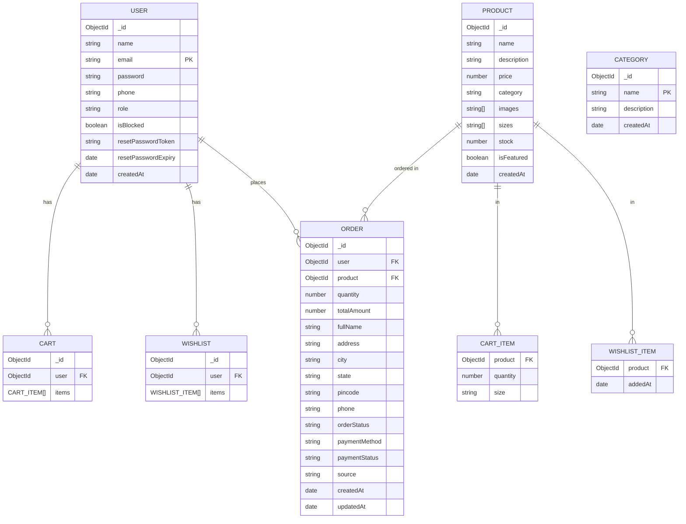

# LIYA E-Commerce Website - Entity Relationship Diagram

## Overview
This ER diagram represents the database schema for the LIYA e-commerce platform built with MongoDB/Mongoose. The system supports user management, product catalog, shopping cart, wishlist, and order processing.

## Mermaid ER Diagram



## Entity Details

### 1. User
**Purpose**: Stores customer and admin information.

| Attribute | Type | Constraints | Description |
|-----------|------|-------------|-------------|
| `_id` | ObjectId | PK | Auto-generated |
| `name` | String | Required | Full name |
| `email` | String | Required, Unique | Login email |
| `password` | String | Min 6 chars | Hashed password |
| `phone` | String | 10 digits | Contact number |
| `role` | String | Enum: ['user', 'admin'] | User type |
| `isBlocked` | Boolean | Default: false | Account status |
| `createdAt` | Date | Default: now | Registration date |

### 2. Category
**Purpose**: Product categorization.

| Attribute | Type | Constraints | Description |
|-----------|------|-------------|-------------|
| `_id` | ObjectId | PK | Auto-generated |
| `name` | String | Required | Category name |
| `description` | String | Max 500 chars | Description |
| `createdAt` | Date | Default: now | Creation date |

**Note**: Referenced by Product as string (denormalized).

### 3. Product
**Purpose**: Product catalog.

| Attribute | Type | Constraints | Description |
|-----------|------|-------------|-------------|
| `_id` | ObjectId | PK | Auto-generated |
| `name` | String | Required | Product name |
| `description` | String | Required | Product details |
| `price` | Number | Required | Price in INR |
| `category` | String | Required | Category name |
| `images` | String[] | - | Product images |
| `sizes` | String[] | Enum sizes | Available sizes |
| `stock` | Number | Required | Available quantity |
| `isFeatured` | Boolean | Default: false | Homepage feature |
| `createdAt` | Date | Default: now | Creation date |

### 4. Cart
**Purpose**: User's shopping cart.

**Structure**: 
```
Cart {
  user: ObjectId (ref: User)
  items: [CartItem]
}
CartItem {
  product: ObjectId (ref: Product)
  quantity: Number
  size: String
}
```

**Virtual**: `itemCount` (total quantity)

### 5. Wishlist
**Purpose**: User's saved products.

**Structure**:
```
Wishlist {
  user: ObjectId (ref: User)
  items: [WishlistItem]
}
WishlistItem {
  product: ObjectId (ref: Product)
  addedAt: Date
}
```

**Virtual**: `itemCount` (total items)

### 6. Order
**Purpose**: Purchase records.

| Attribute | Type | Constraints | Description |
|-----------|------|-------------|-------------|
| `_id` | ObjectId | PK | Auto-generated |
| `user` | ObjectId | FK: User | Customer |
| `product` | ObjectId | FK: Product | Ordered product |
| `quantity` | Number | Required | Quantity |
| `totalAmount` | Number | Required | Total price |
| `fullName` | String | Required | Shipping name |
| `address` | String | Required | Shipping address |
| `city` | String | Required | City |
| `state` | String | Required | State |
| `pincode` | String | Required | PIN code |
| `phone` | String | Required | Contact |
| `orderStatus` | String | Enum workflow | Pending→Delivered |
| `paymentMethod` | String | Enum: ['COD'] | Payment type |
| `paymentStatus` | String | Enum: ['Pending', 'Paid'] | Payment status |
| `source` | String | Enum: ['cart', 'buy-now'] | Order origin |
| `createdAt` | Date | Default: now | Order date |
| `updatedAt` | Date | Auto-update | Last update |

## Relationships Summary

| Relationship | Cardinality | Description |
|--------------|-------------|-------------|
| User → Cart | 1:N | One user has one cart |
| User → Wishlist | 1:N | One user has one wishlist |
| User → Order | 1:N | One user places many orders |
| Product → CartItem | 1:N | Product appears in many cart items |
| Product → WishlistItem | 1:N | Product appears in many wishlists |
| Product → Order | 1:N | Product appears in many orders |

## Design Notes
1. **Denormalization**: Product.category stores category name as string (not ObjectId ref)
2. **Embedded Documents**: Cart/Wishlist use embedded item arrays for performance
3. **Order Model**: Simplified single-product orders (no order items array)
4. **Payment**: Currently supports COD only
5. **Text Search**: Product has text index on name+description

## Data Flow
```
User → Add to Cart/Wishlist → Checkout → Order → Status Updates
```

This schema supports core e-commerce functionality: browsing, cart management, wishlist, checkout, order tracking.
