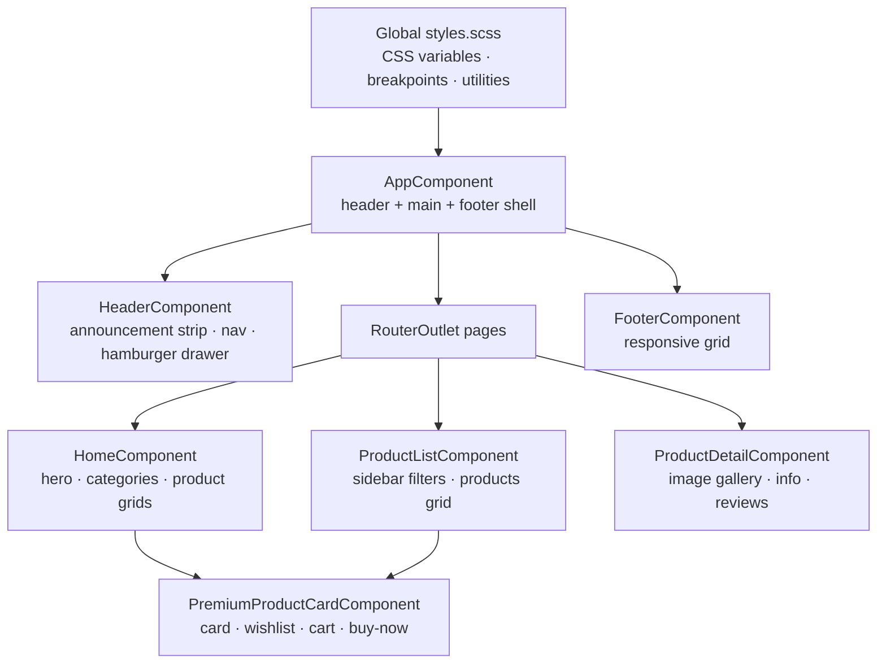
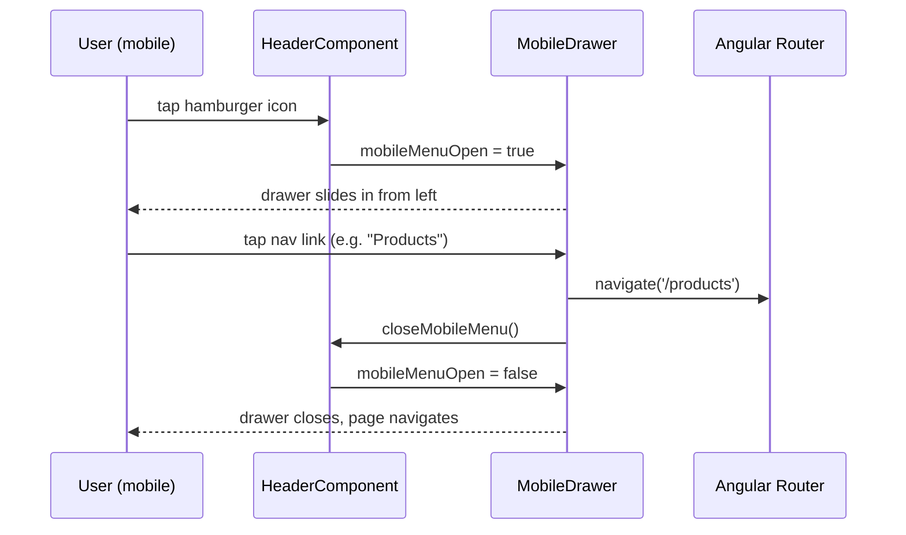
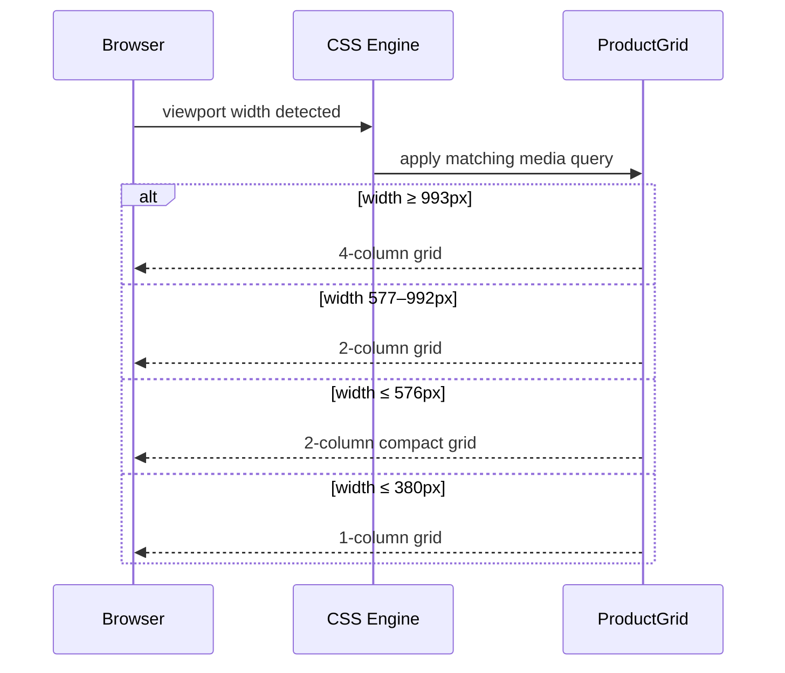

# Design Document: Mobile Responsive UI

## Overview

Make the Liya Creation Angular 17 e-commerce frontend fully responsive and mobile-friendly across all device sizes (320px–2560px+). The work covers the fixed header with hamburger navigation, product card layout improvements on small screens, and global layout fixes so every page renders correctly on phones, tablets, and desktops.

The project already has a solid responsive foundation (CSS custom properties, fluid type scale, breakpoint utility classes, a mobile drawer in the header, and SCSS media queries in each component). This feature closes the remaining gaps and ensures a polished, consistent experience on mobile.

---

## Architecture



---

## Responsive Breakpoint System

The existing breakpoint ladder (already in `styles.scss`) is the single source of truth:

| Token | Width | Target |
|---|---|---|
| xs | ≤ 320px | Tiny phones (iPhone SE 1st gen) |
| sm | ≤ 480px | Small phones |
| md | ≤ 576px | Standard phones |
| lg | ≤ 768px | Tablet portrait |
| xl | ≤ 992px | Tablet landscape / small laptop |
| 2xl | ≤ 1200px | Laptop |
| 3xl | ≥ 1440px | Large desktop |

Utility classes already defined: `.hide-mobile` (hidden ≤ 768px), `.hide-tablet` (hidden ≤ 992px), `.hide-desktop` (hidden ≤ 1200px).

---

## Components and Interfaces

### Component 1: HeaderComponent

**Purpose**: Fixed top navigation with announcement strip, logo, desktop nav, action icons (wishlist/cart/user), and mobile hamburger drawer.

**Current state**: Announcement strip (36px, fixed, z-index 1001) + header (fixed, top 36px, z-index 1000). Mobile drawer slides in from left. Hamburger toggle shown via `.hide-desktop` at ≤ 1200px; desktop nav hidden via `.hide-mobile` at ≤ 768px — **mismatch to fix**.

**Interface**:
```typescript
interface HeaderState {
  isScrolled: boolean;        // adds glass background on scroll
  mobileMenuOpen: boolean;    // controls drawer visibility
  isDropdownOpen: boolean;    // user dropdown
  animCart: number;           // animated cart count
  animWishlist: number;       // animated wishlist count
}
```

**Responsibilities**:
- Show hamburger button at ≤ 992px (align with nav hide breakpoint)
- Drawer nav links: Home, All Products, Categories (Lehengas, Saree, Gowns, Kurtis), Wishlist, Cart, Login/Sign Up or user account links
- Announcement strip stays visible on mobile (height may reduce to 28px on ≤ 576px)
- Header `padding-top` on `<main>` must account for strip + header height at every breakpoint

**Breakpoint behaviour**:
```
≥ 993px  → desktop nav visible, hamburger hidden
≤ 992px  → desktop nav hidden, hamburger visible
≤ 576px  → announcement strip height: 28px; header padding reduced
```

---

### Component 2: PremiumProductCardComponent

**Purpose**: Reusable product card with image, wishlist, quick-view, size selector, quantity, add-to-cart, and buy-now.

**Interface**:
```typescript
interface PremiumProduct {
  _id: string;
  name: string;
  images: string[];
  originalPrice: number;
  discountedPrice: number;
  isPremium: boolean;
  stock: number;
  category: string;
  rating?: number;
  reviewsCount?: number;
  sizes?: string[];
}
```

**Mobile improvements needed**:
- Image aspect ratio `4/5` maintained at all sizes — already correct
- Action buttons (`Add to Cart` + `Buy Now`) stack vertically on ≤ 576px — already in SCSS, verify
- Size buttons wrap correctly on narrow cards
- Wishlist button (44×44px touch target) — already correct
- Product name truncates to 2 lines with `line-clamp` on small cards
- Price font size scales down gracefully

---

### Component 3: HomeComponent — Product Grid

**Purpose**: Displays featured products and new arrivals in a responsive grid.

**Current grid**:
```
≥ 1201px → 4 columns
≤ 1200px → 3 columns
≤ 992px  → 2 columns
≤ 576px  → 2 columns
≤ 380px  → 1 column
```

**Improvement**: At 380px–576px, 2-column grid with compact cards is acceptable but card content must not overflow. Verify `gap` reduces on mobile.

---

### Component 4: ProductListComponent — Layout

**Purpose**: Sidebar filters + product grid page.

**Current layout**:
```
≥ 993px  → sidebar (280px) + main grid (3 cols)
≤ 992px  → sidebar hidden, mobile filter bar shown, grid (2 cols)
≤ 576px  → grid (1 col)
```

**Improvement**: Mobile filter bar (`filter-toggle` + sort select) must be `display: flex` at ≤ 992px — already coded, verify it renders correctly.

---

### Component 5: ProductDetailComponent

**Purpose**: Full product detail page with image gallery, info panel, reviews, and related products.

**Current layout**: `grid-template-columns: 1fr 1fr` — no mobile override present.

**Required mobile layout**:
```
≥ 769px  → side-by-side (1fr 1fr)
≤ 768px  → stacked (single column)
≤ 576px  → full-width, reduced padding, action buttons full-width
```

**Trust badges**: `grid-template-columns: 1fr 1fr` — fine on mobile, reduce padding.

**Related products grid**: needs `repeat(2,1fr)` at ≤ 576px and `repeat(1,1fr)` at ≤ 380px.

---

### Component 6: FooterComponent

**Current layout**:
```
≥ 993px  → 4-column grid
≤ 992px  → 2-column grid, brand spans 2
≤ 576px  → 1-column, newsletter form stacks
```

Status: already responsive — no changes needed.

---

## Data Models

### Breakpoint Map (CSS)

```scss
$breakpoints: (
  'xs':  320px,
  'sm':  480px,
  'md':  576px,
  'lg':  768px,
  'xl':  992px,
  '2xl': 1200px,
  '3xl': 1440px
);
```

### Header Height Model

```typescript
interface HeaderHeights {
  announcementStrip: {
    default: 36,   // px
    mobile: 28     // px, ≤ 576px
  };
  header: {
    default: 80,   // px (approx, padding 1.25rem top+bottom + logo)
    mobile: 64     // px, ≤ 576px
  };
  totalOffset: {
    default: 116,  // strip + header
    mobile: 92     // strip + header on mobile
  };
}
```

`<main>` `padding-top` must equal `totalOffset` at each breakpoint.

---

## Sequence Diagrams

### Mobile Navigation Flow



### Responsive Product Grid Render



---

## Key Changes with Formal Specifications

### Fix 1: Header hamburger breakpoint alignment

**File**: `header.component.ts`

**Preconditions**:
- `.hide-mobile` hides elements at `≤ 768px`
- `.hide-desktop` hides elements at `≤ 1200px`
- Desktop nav uses `.hide-mobile`

**Problem**: Hamburger uses `.hide-desktop` (hidden ≤ 1200px) but nav uses `.hide-mobile` (hidden ≤ 768px) — gap between 769px–1200px where both are hidden.

**Fix**: Change hamburger toggle class from `.hide-desktop` to a new class or inline media query that shows it at `≤ 992px` (matching when nav disappears).

**Postconditions**:
- At any viewport width, either the desktop nav OR the hamburger is visible (never both hidden simultaneously)
- `∀ width: (width > 992 → nav visible ∧ hamburger hidden) ∨ (width ≤ 992 → nav hidden ∧ hamburger visible)`

---

### Fix 2: ProductDetailComponent mobile layout

**File**: `product-detail.component.ts` (inline styles)

**Preconditions**: `.product-layout` uses `grid-template-columns: 1fr 1fr` with no responsive override.

**Fix**: Add media queries:
```scss
@media (max-width: 768px) {
  .product-layout {
    grid-template-columns: 1fr;
    gap: var(--spacing-xl);
    padding: var(--spacing-xl) 0 var(--spacing-2xl);
  }
}
@media (max-width: 576px) {
  .product-layout { padding: var(--spacing-lg) 0 var(--spacing-xl); }
  .product-info .action-buttons { flex-direction: column; }
  .product-info .action-buttons .btn { width: 100%; }
  .related-grid { grid-template-columns: repeat(2, 1fr); }
}
@media (max-width: 380px) {
  .related-grid { grid-template-columns: 1fr; }
}
```

**Postconditions**:
- On screens ≤ 768px, image gallery appears above product info (single column)
- Action buttons are full-width on ≤ 576px

---

### Fix 3: main padding-top on mobile

**File**: `app.component.ts`

**Preconditions**: `main { padding-top: 80px }` — does not account for announcement strip (36px) or mobile header height reduction.

**Fix**:
```scss
main {
  min-height: calc(100vh - 200px);
  padding-top: 116px; /* 36px strip + 80px header */
}
@media (max-width: 576px) {
  main { padding-top: 92px; } /* 28px strip + 64px header */
}
```

**Postconditions**:
- No content is hidden behind the fixed header at any breakpoint
- `∀ breakpoint: main.paddingTop ≥ announcementStrip.height + header.height`

---

### Fix 4: Product card name line-clamp

**File**: `premium-product-card.component.scss`

**Preconditions**: `.product-name` has no overflow control — long names can break card layout on narrow grids.

**Fix**:
```scss
.product-name {
  display: -webkit-box;
  -webkit-line-clamp: 2;
  -webkit-box-orient: vertical;
  overflow: hidden;
}
```

**Postconditions**:
- Product name never exceeds 2 lines regardless of length
- Card height remains consistent within a grid row

---

## Algorithmic Pseudocode

### Responsive Header Visibility Algorithm

```pascal
ALGORITHM resolveHeaderVisibility(viewportWidth)
INPUT: viewportWidth (number, pixels)
OUTPUT: { showDesktopNav: boolean, showHamburger: boolean }

BEGIN
  IF viewportWidth > 992 THEN
    RETURN { showDesktopNav: true, showHamburger: false }
  ELSE
    RETURN { showDesktopNav: false, showHamburger: true }
  END IF
END
```

**Preconditions**: `viewportWidth > 0`
**Postconditions**: Exactly one of `showDesktopNav` or `showHamburger` is `true`
**Invariant**: `showDesktopNav XOR showHamburger = true`

---

### Grid Column Resolution Algorithm

```pascal
ALGORITHM resolveGridColumns(viewportWidth, context)
INPUT: viewportWidth (number), context ('home' | 'product-list')
OUTPUT: columns (number)

BEGIN
  IF context = 'home' THEN
    IF viewportWidth >= 1201 THEN RETURN 4
    ELSE IF viewportWidth >= 993 THEN RETURN 3
    ELSE IF viewportWidth >= 381 THEN RETURN 2
    ELSE RETURN 1
    END IF
  ELSE IF context = 'product-list' THEN
    IF viewportWidth >= 1201 THEN RETURN 3
    ELSE IF viewportWidth >= 577 THEN RETURN 2
    ELSE RETURN 1
    END IF
  END IF
END
```

**Preconditions**: `viewportWidth > 0`, `context ∈ {'home', 'product-list'}`
**Postconditions**: `columns ∈ {1, 2, 3, 4}`

---

## Correctness Properties

### P1: Header mutual exclusivity
For all viewport widths, the desktop nav and hamburger button are never simultaneously hidden or simultaneously visible:
```
∀ width ∈ ℕ⁺:
  (width > 992 → desktopNav.visible = true  ∧ hamburger.visible = false) ∧
  (width ≤ 992 → desktopNav.visible = false ∧ hamburger.visible = true)
```

### P2: Main content not obscured
For all breakpoints, `main.paddingTop ≥ headerTotalHeight`:
```
∀ breakpoint b:
  main.paddingTop(b) ≥ announcementStrip.height(b) + header.height(b)
```

### P3: Touch target minimum size
All interactive elements (buttons, links, inputs) meet the 44×44px minimum touch target:
```
∀ element ∈ {button, a, input, select}:
  element.minHeight ≥ 44px
```
(Already enforced globally in `styles.scss`.)

### P4: Product grid column count
Grid columns are always ≥ 1 and ≤ 4, and decrease monotonically as viewport narrows:
```
∀ w1 < w2: gridColumns(w1) ≤ gridColumns(w2)
```

### P5: Product card height consistency
Within a grid row, all cards have equal height (CSS Grid stretch alignment):
```
∀ row r in productGrid:
  ∀ card c1, c2 ∈ row r: c1.height = c2.height
```

### P6: Mobile drawer state
When `mobileMenuOpen = false`, the drawer overlay and drawer panel are not rendered in the DOM (Angular `@if` block):
```
mobileMenuOpen = false → drawer ∉ DOM ∧ overlay ∉ DOM
```

---

## Error Handling

### Scenario 1: Viewport resize during open drawer
**Condition**: User resizes from mobile to desktop while drawer is open.
**Response**: `@HostListener('window:resize')` closes the drawer when width exceeds 992px.
**Recovery**: Desktop nav becomes visible; no orphaned overlay.

### Scenario 2: Image load failure in product card
**Condition**: Product image 404s on slow mobile connection.
**Response**: `onImageError()` sets `imageLoaded = false`; skeleton loader remains visible.
**Recovery**: Fallback placeholder image URL is used.

### Scenario 3: Scroll lock when drawer is open
**Condition**: Mobile drawer open; user scrolls body behind overlay.
**Response**: Add `overflow: hidden` to `body` when `mobileMenuOpen = true`.
**Recovery**: Remove on drawer close.

---

## Testing Strategy

### Unit Testing Approach
- Test `resolveHeaderVisibility` logic: given width > 992, hamburger hidden; given width ≤ 992, nav hidden.
- Test `closeMobileMenu()` is called on route navigation.
- Test `padding-top` CSS values at each breakpoint using computed styles.

### Property-Based Testing Approach
**Property Test Library**: Jasmine + Angular CDK BreakpointObserver (or manual viewport resize in tests)

Key properties to test:
- For any random viewport width in [320, 2560], grid columns are in {1, 2, 3, 4}
- For any viewport width, `main.paddingTop ≥ headerHeight`
- Product card height is uniform within a grid row at any viewport width

### Integration Testing Approach
- E2E (Cypress/Playwright): open site at 375px (iPhone), verify hamburger visible, tap it, verify drawer opens with all nav links, tap "Products", verify navigation and drawer closes.
- Visual regression: screenshot comparison at 375px, 768px, 1024px, 1440px.

---

## Performance Considerations

- Announcement strip marquee animation uses CSS `transform` (GPU-accelerated) — no change needed.
- Mobile drawer uses `position: fixed` — no layout reflow on open.
- Product images use `loading="lazy"` — already implemented.
- Category track uses `overflow-x: auto` with `scroll-snap` — smooth on mobile.
- Avoid adding JavaScript resize listeners; use CSS media queries exclusively for layout changes.

---

## Security Considerations

- No new attack surface introduced — changes are purely CSS/layout.
- Mobile drawer navigation links use Angular `routerLink` — no raw `href` with user input.

---

## Dependencies

- Angular 17 (standalone components, signals) — already in use
- Font Awesome 6 (hamburger/close icons) — already loaded
- Playfair Display + Lora fonts (Google Fonts) — already loaded
- No new npm packages required
